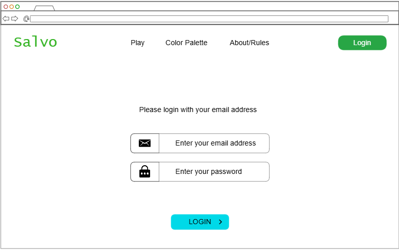
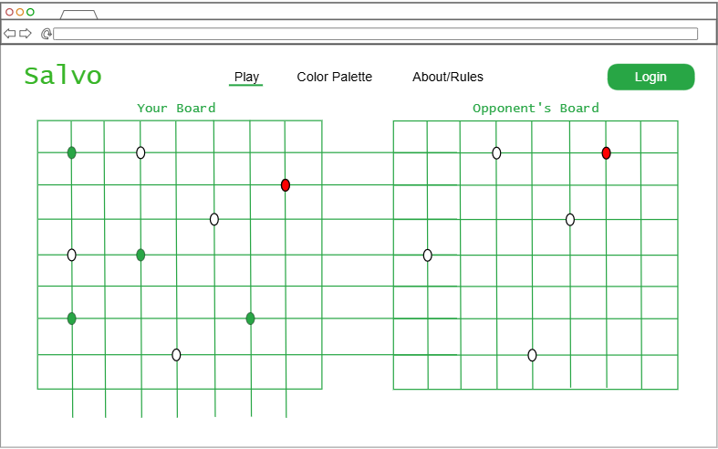
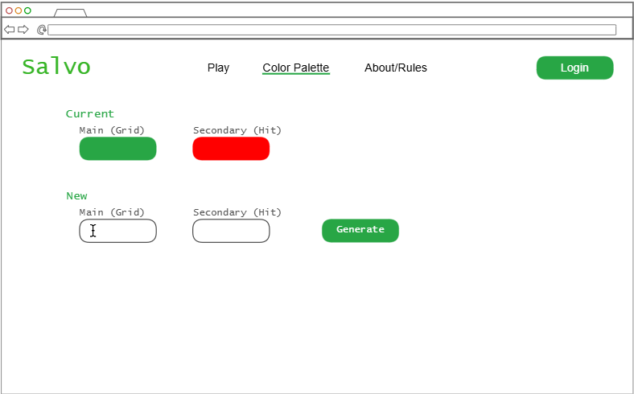
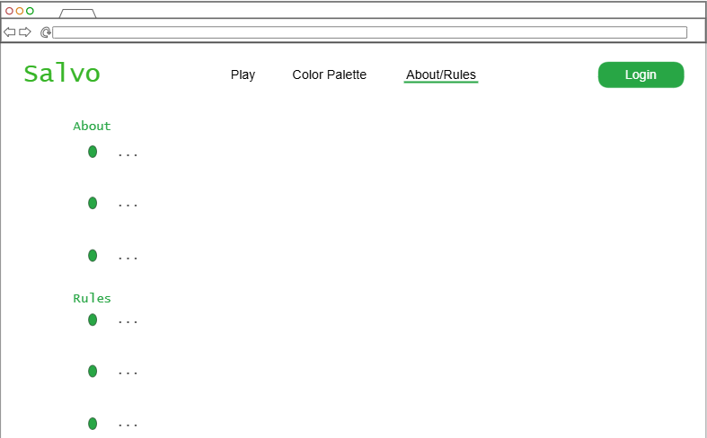

# Salvo Attack
Salvo Attack is a spinoff of the well-known game of Battleship. In this online naval battle game, you will be able to attack with each of your ships, trying to sink your opponent's ships before they sink yours!

## Notes File
[HERE](notes.md)

## Website link
[salvoattack](https://startup.salvoattack.click)

## Specification Deliverable
### Elevator Pitch
If you've gotten bored with the original version of the game Battleship, then this spinoff may interest you! You can play out a more realistic naval battle with a friend online! Similar to real overseas combat, each turn you will be able to attack with each ship in your armada that has not yet been sunk. Try and take out your opponent's fleet before they sink yours.

### Design
#### Login Page

#### Play Page

#### Change Color Palette Page

#### About/Rules Page

### Key Features
- Login, logout, and register
- Play by choosing spots to place your ships and spots to attack your opponent's ships
- Opponent's moves displayed when they are submitted and your hits on their ships are displayed when you hit them
- See a description of the app
- Change the color palette

### Technologies
I am going to use the required technologies in the following ways:

- HTML - Four different views, login/register controls, play, change color palette, and about.
- CSS - Application styling for different screen sizes, responsive design, good whitespace.
- React - Routing between views, dynamically change color palette, and reactive user controls.
- Service - Endpoints for authentication, storing/retrieving ship positions and hits. Third party call to get color palette.
- DB/Login - Stores authentication, positions, and hits.
- WebSocket - Broadcast opponent's attacks and hits.

## HTML Deliverable
For this deliverable I built out the structure of my application using HTML.

- [x] **HTML pages** - Four HTML pages that represent the ability to login, play, customize the color palette, and learn about the website and the rules.
- [x] **Proper HTML element usage** - I used HTML tags, including BODY, NAV, MAIN, HEADER, FOOTER, to give structure to the pages. I also used buttons, inputs, color pickers, svgs, and more to add some functionality/design to the pages.
- [x] **Links** - All pages link to the other pages.
- [x] **Text** - About/rules page has textual description of the page and the rules of the game.
- [x] **Placeholder for 3rd party service calls** - The 'generate' button in the color palette page will be linked to an external API to generate a custom color palette for the website.
- [x] **Images** - Displays title image on each page.
- [x] **Login** - Placeholder for authentication on the login page. Place for user's name to be displayed on the play page.
- [x] **DB** - Authentication information, including the user's name, as well as the user's custom palette for the site will be stored in the database and displayed on the play (user's name) and color palette (custom palette as current colors) pages respectively.
- [x] **WebSocket** - The player and opponent's boards on the play page will populate in real time with hits and misses.

## CSS Deliverable
For this deliverable I properly styled the application into its final appearance.

- [x] **Header, footer, and main content body** - All the pages of the application have these sections.
- [x] **Navigation elements** - I used bootstrap to style the navigation links and added an underline to highlight the active page.
- [x] **Responsive to window resizing** - My app looks great on all window sizes and devices.
- [x] **Application elements** - I styled the elements with good whitespace, contrast, and appealing coloring.
- [x] **Application text content** - The fonts are consistent and the coloring and sizing of different sections gives them contrast.
- [x] **Application images** - I made the image of the logo in the header a brand element in the navigation bar and gave the navigation elements the proper spacing next to it.

## React Part 1: Routing Deliverable
For this deliverable, I did the following:

- [x] **Bundled using Vite** - I bundled the application using Vite.
- [x] **Multiple react components that contain your HTML and CSS** - I converted all my individual pages (login, play, color palette, and about/rules) to react components.
- [x] **React router** - I implemented a react router in the app component to route between the different pages.

## React Part 2: Reactivity Deliverable
For this deliverable I used JavaScript and React so that the application completely works for a single user. I also added placeholders for future technology.

- [x] **Multiple react components that implement or mock all app functionality** - Everything works! Colors and login are stored in local storage. There is a spot to receive a color palette from an API call to generate a custom color palette. setTimeout is used to simulate getting the opponent's ship positions and attacks.
- [x] **React `useState` and `useEffect` hooks** - useState is used in the app, color_palette, unauthenticated, board, and play components. useEffect is used in the board and play components.