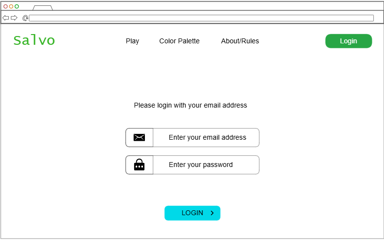
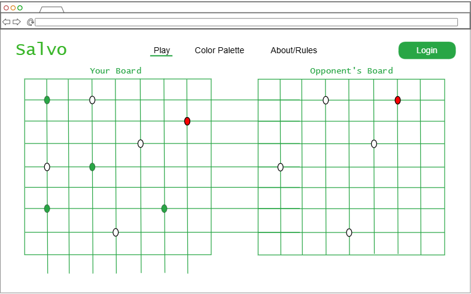
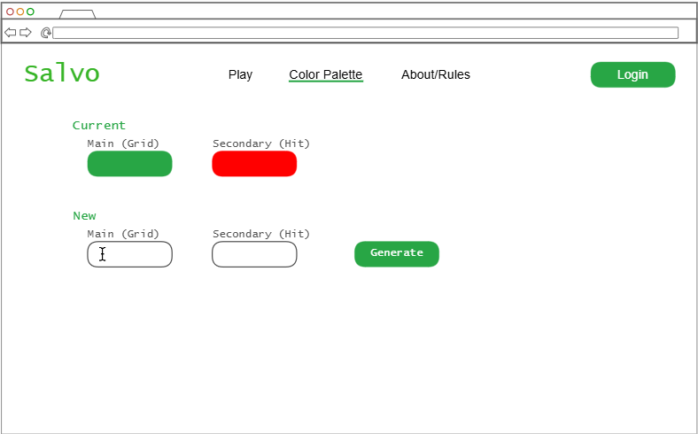
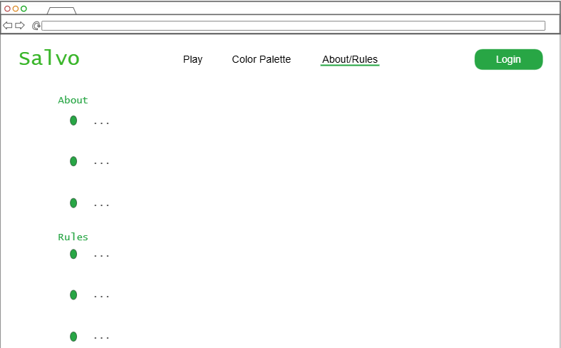

# Salvo
Salvo is a spinoff of the well-known game of Battleship. In this online naval battle game, you will be able to attack with each of your ships, trying to sink your opponent's ships before they sink yours!

## Notes File
[HERE](notes.md)

## Website link
[salvoattack](https://startup.salvoattack.click)

## Specification Deliverable
### Elevator Pitch
If you've gotten bored with the original version of the game Battleship, then this spinoff may interest you! You can play out a more realistic naval battle with a friend online! Similar to real overseas combat, each turn you will be able to attack with each ship in your armada that has not yet been sunk. Try and take out your opponent's fleet before they sink yours.

### Design
#### Login Page

#### Play Page

#### Change Color Palette Page

#### About/Rules Page

### Key Features
- Login, logout, and register
- Play by choosing spots to place your ships and spots to attack your opponent's ships
- Opponent's moves displayed when they are submitted and your hits on their ships are displayed when you hit them
- See a description of the app
- Change the color palette

### Technologies
I am going to use the required technologies in the following ways:

- HTML - Four different views, login/register controls, play, change color palette, and about.
- CSS - Application styling for different screen sizes, responsive design, good whitespace.
- React - Routing between views, dynamically change color palette, and reactive user controls.
- Service - Endpoints for authentication, storing/retrieving ship positions and hits. Third party call to get color palette.
- DB/Login - Stores authentication, positions, and hits.
- WebSocket - Broadcast opponent's attacks and hits.

## HTML Deliverable